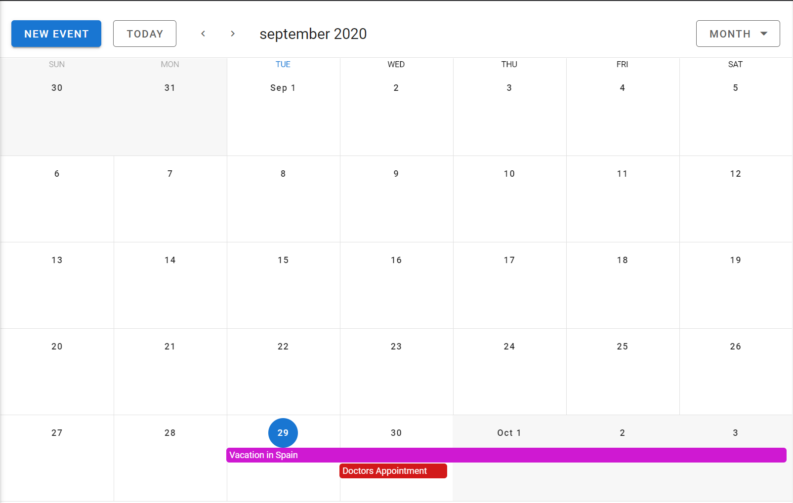

# Project Title
 Vue JS Calendar

## Table of contents
* [General info](#general-info)
* [Technologies](#technologies)
* [Setup](#setup)

## General info
This project is a Vue js Calendar with Firebase integration. This project is just for some extra xercising within Vue JS and connecting it with Firebase.
	
## Technologies
Project is created with:
* Node JS version: 12.18.3
* @vue/cli version: 4.5.6
* Vue JS version: 2.6.10
* Vuetify version: 2.2.11
* Core JS version: 3.6.5

## Running Locally

1. Clone this repo
2. ``` 
    cd vue-calendar
   ```
3. ``` 
    npm i
    ```
2. ``` 
    npm run serve
   ```

## Tech Stack

* Vue.js
* Vue CLI
* Vuetify

## Screenshot



## File Structure